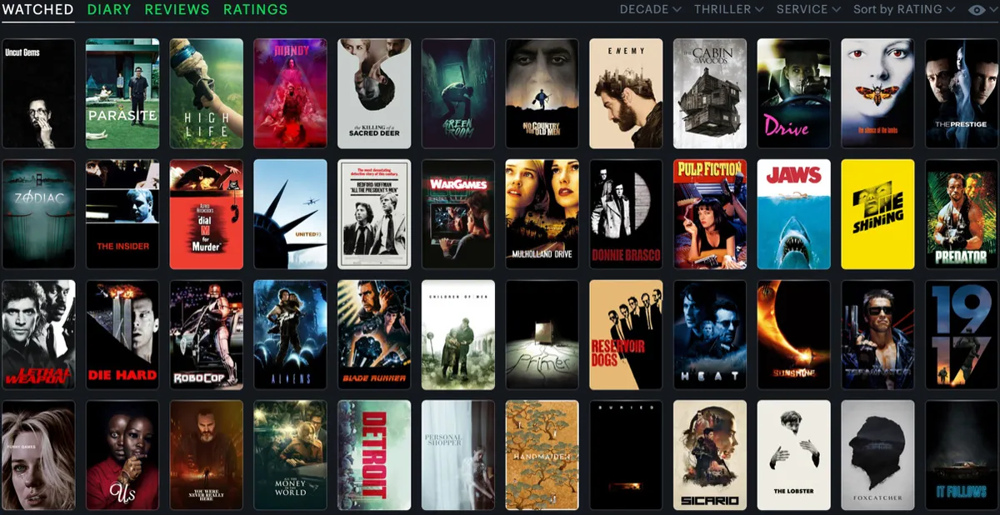

# TMDB Movies Data Analysis

This repository contains a data analysis project focused on the TMDB (The Movie Database) movies dataset. The dataset provides a wealth of information about various movies, including details like release year, genres, popularity, revenue, and more. The goal of this project is to explore, analyze, and visualize key insights from the dataset.

## Key Features

- **Data Collection**: Here, I simply imported the dataset from an CSV file in the working environment.

- **Data Wrangling**: Here, I got familiar with the dataset by exploring its structure, attributes, and statistics.

- **Data Cleaning**: In this section, I tranformed the dataset from a raw data format to a clean and appropriate format for susquent analysis.

- **Exploratory Analysis**: In this section, I investigated the dataset based on the presented questions.

- **Visualizations**: Insightful visualizations were created using Matplotlib to showcase my findings.

## Dataset

The TMDB movies dataset used in this project contains information about thousands of movies, including attributes like title, budget, revenue, genres, runtime, release date, and more. The dataset is available for download from [Kaggle](https://www.kaggle.com/datasets/juzershakir/tmdb-movies-dataset).

## Contributing

Contributions to this project are welcome! If you find any issues or have suggestions for improvement, feel free to create an issue or submit a pull request.

Happy analyzing!